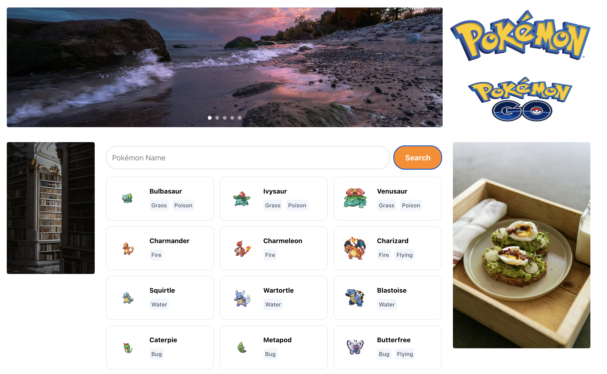

# Fullstack Pokédex Assessment



A full-stack web application that aggregates Pokémon data using a **Laravel** backend and displays it via a responsive **Next.js** frontend.

## 🚀 Tech Stack

**Backend**
* **Framework:** Laravel 11 (API Only)
* **Language:** PHP 8.2+
* **Database:** SQLite (No external DB setup required)

**Frontend**
* **Framework:** Next.js 14 (App Router)
* **Styling:** Tailwind CSS
* **Language:** TypeScript

---

## 🛠️ Setup Instructions

### Prerequisites
* PHP 8.2 or higher
* Composer (Required for installing backend dependencies)
* Node.js (v18+) & NPM

### 1. Backend Setup (Laravel)
Navigate to the backend folder and install dependencies.

```bash
cd backend
composer install
```

Copy the environment file and generate the application key.

```bash
cp .env.example .env
php artisan key:generate
```

Create the SQLite database file. Note: The database file is not included in the repo for security. You must create it manually.

```bash
# Mac / Linux
touch database/database.sqlite

# Windows (PowerShell)
New-Item database/database.sqlite
```

Run Migrations. This creates the necessary tables (including the system cache table required for the API to run).

```bash
php artisan migrate
```

Serve the application (Runs on http://localhost:8000).

```bash
php artisan serve
```

### 2. Frontend Setup (Next.js)

Open a new terminal, navigate to the frontend folder, and install dependencies.

```bash
cd frontend
npm install
```

Run the development server (Runs on http://localhost:3000).

```bash
npm run dev
```

The website will be available at **[http://localhost:3000/](http://localhost:3000/)**.

---

## 📡 API Documentation

### Get Pokémon List

Returns a paginated list of Pokémon with details merged from multiple API endpoints.

**Endpoint:** `GET /api/pokemons`

**Parameters:**
| Parameter | Type | Default | Description |
| :--- | :--- | :--- | :--- |
| `page` | `int` | `1` | The page number to retrieve. |
| `limit` | `int` | `20` | Number of items per page (Max 100). |
| `search` | `string` | `null` | Optional search term (e.g., "saur"). |

**Response Example:**

```json
[
  {
    "name": "bulbasaur",
    "image": "[https://raw.githubusercontent.com/PokeAPI/sprites/master/sprites/pokemon/other/official-artwork/1.png](https://raw.githubusercontent.com/PokeAPI/sprites/master/sprites/pokemon/other/official-artwork/1.png)",
    "types": ["grass", "poison"],
    "height": 7,
    "weight": 69
  }
]

```

---

## 📄 License

This project is open-sourced software licensed under the [MIT license](https://opensource.org/licenses/MIT).

```

```